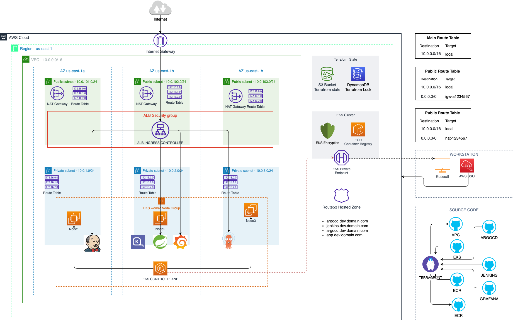

Magento 2 for Development (For Apple Silicon)
===

## 🏠 Architecture



### 🖥️ Initialization

```bash
export TF_VAR_dev_account_id=000000000000

terragrunt run-all init --upgrade --terragrunt-working-dir infrastructure/non-prod/us-east-1/dev
terragrunt run-all plan --terragrunt-working-dir infrastructure/non-prod/us-east-1/dev
terragrunt run-all apply -auto-approve --terragrunt-working-dir infrastructure/non-prod/us-east-1/dev
```

### 🖥️ Destroy

```bash
cd infrastructure/non-prod/us-east-1/dev
terragrunt run-all destroy

find . -type d -name ".terragrunt-cache" -prune -exec rm -rf {} \;
find . -type d -name ".terraform.lock.hcl" -prune -exec rm -rf {} \;
```

### Nginx (1.22) + Redis (7.0) + PHP-FPM (8.2) + MySQL (8.0.34) + XDebug (3.2.2) + Mailhog + RabbitMQ (3.11) + OpenSearch (2.5.0) + Varnish (7.3)

The docker stack is composed of the following containers
- redis
- rabbitmq
- opensearch
- opensearch dashboard
- mailhog
- php-fpm
- nginx
- mysql
- varnish

### Setting up Magento
To access the magento homepage, go to the following url: http://magento2.localhost.loc<br>

Also, you can open:<br>

http://mail.magento2.localhost.loc - **Mailhog**<br>
http://search.magento2.localhost.loc - **OpenSearch**<br>
http://dashboard.magento2.localhost.loc - **OpenSearch Dashboard**<br>
http://rabbit.magento2.localhost.loc - **RabbitMQ** (guest/guest for access)<br>


### Bugs:

* `Error: reading EKS Cluster: couldn't find resource`

    https://github.com/gruntwork-io/terragrunt/issues/2225

    `Workround` - Runt each module separate (Network/EKS/Helm Charts)

    ```bash
    terragrunt apply --terragrunt-working-dir infrastructure/non-prod/us-east-1/dev/data-sources -auto-approve
    terragrunt apply --terragrunt-working-dir infrastructure/non-prod/us-east-1/dev/vpc-network -auto-approve
    terragrunt apply --terragrunt-working-dir infrastructure/non-prod/us-east-1/dev/eks-cluster -auto-approve

    terragrunt apply --terragrunt-working-dir infrastructure/non-prod/us-east-1/dev/eks-cluster-irsa/vpc-cni -auto-approve
    terragrunt apply --terragrunt-working-dir infrastructure/non-prod/us-east-1/dev/eks-cluster-addons -auto-approve
    ```

* `Error: reading EKS Cluster: couldn't find monitoring resource`

    ```bash
    terragrunt apply --terragrunt-working-dir infrastructure/non-prod/us-east-1/dev/eks-services/grafana -auto-approve
    ```

* `Error: │ no matches for kind "Provisioner" in group "karpenter.sh"`

<!-- BEGIN_TF_DOCS -->
## Requirements

No requirements.

## Providers

No providers.

## Modules

No modules.

## Resources

No resources.

## Inputs

No inputs.

## Outputs

No outputs.
<!-- END_TF_DOCS -->